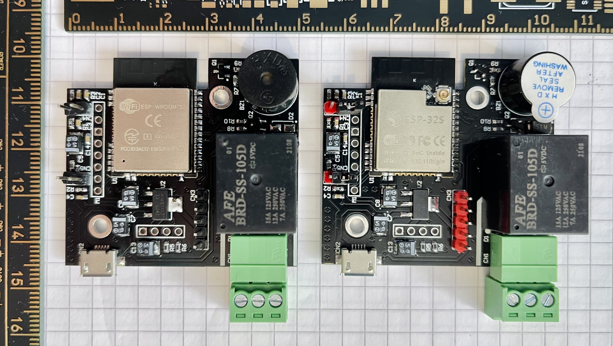
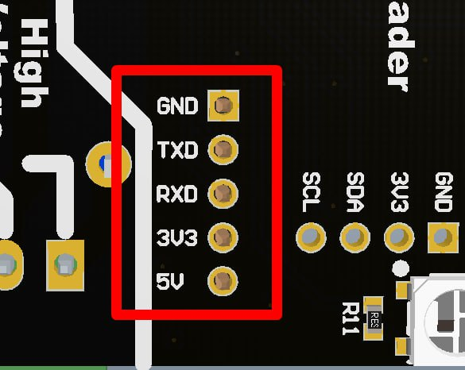
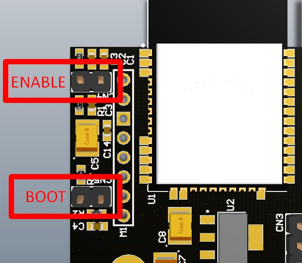

# PRISMO readers
# (WIP)



[Protocol description](./doc/protocol.md)

## Flashing instructions

Before any development mode interactions with the board it needs to be connected to a computer.
The interface intended for flashing and debugging is UART. Please connect your USB-UART adapter to the pins on the board as shown on the image below:


```
READER  USB-UART
5V  ->  5V
GND ->  GND
RX  ->  TX
TX  ->  RX
optional
3V3 ->  3V3
```

First of all the information about Micropython and it's installation can be found on their official page: [https://micropython.org/download/esp32/](https://micropython.org/download/esp32/)


Depending on your prefered OS the USB-UART can be named differently.
For example:
 - MacOS `/dev/tty.usbserial-1220`
 - Ubuntu `/dev//dev/ttyUSB0`
 - Windows `COM1`

To enter to the flashing mode the board should start with BOOT0 pin pulled to GND.
In order to achieve that short and hold BOOT pins, then short and release ENABLE pins and then release BOOT pins.



The commands also available below:
```sh
esptool.py --chip esp32 --port /dev/tty.usbserial-1220 erase_flash
```

```sh
esptool.py --chip esp32 --port /dev/tty.usbserial-1220 --baud 460800 write_flash -z 0x1000 esp32-20230426-v1.20.0.bin
```

To put source code files on board (ampy)[https://pypi.org/project/adafruit-ampy/] tool is needed.
Put all files from `src` folder to the board one by one.
> It is better for the main.py to be the last one.
>
> main.py starts processes which may affect further access to the board by `ampy` tool
> If that has happened - please enter to the REPL (`picocom` is a nice tool for that) mode and remove `main.py` manually.
> Use this prompt: `import os; os.remove('main.py')`. Don't forget to put `main.py` back in order to be back to normal operation.

```sh
ampy -p /dev/tty.usbserial-11210 -b115200 -d4 put boot.py
ampy -p /dev/tty.usbserial-11210 -b115200 -d4 put PN532.py
ampy -p /dev/tty.usbserial-11210 -b115200 -d4 put config.py
ampy -p /dev/tty.usbserial-11210 -b115200 -d4 put main.py
```
-----------
### HW test

After flashing your device, you can test your hardware. To do this, uncomment `HW_TEST` in `settings.h` file and flash this firmware. In serial monitor, with key is near the RFID frame (baudrate 9600) you should get something like this:

```
------ HW TEST STARTED --------
17:38:34.011 -> ------ HW TEST STARTED --------
17:38:37.001 -> 33384541313932323930304532333845413139323239303045323338454131393232393030453233384541313932323930304532333845413139323239303045323338454131393232393030453233384541
17:38:40.620 -> ------ HW TEST STARTED --------
17:38:43.608 -> ------ HW TEST STARTED --------

```

### Connection test with test server

Comment back `HW_TEST` in `settings.h` and specify network settings there.

```
STASSID	- name of your wifi network
STAPSK 	- password to your wifi network
HOST 	- IP address to your test server.
PORT	- Unique port of your reader
```

In `test_server.py` choose right `MY_IP` - IP of machine where `test_server.py` running and `READER_PORT`.